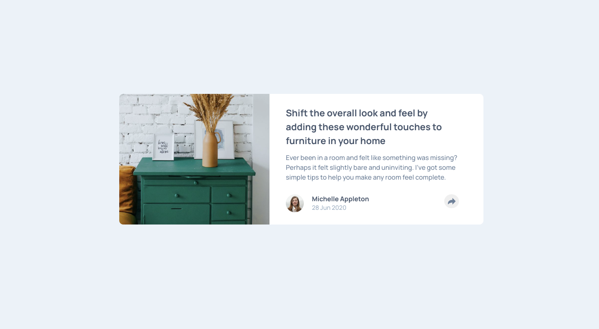
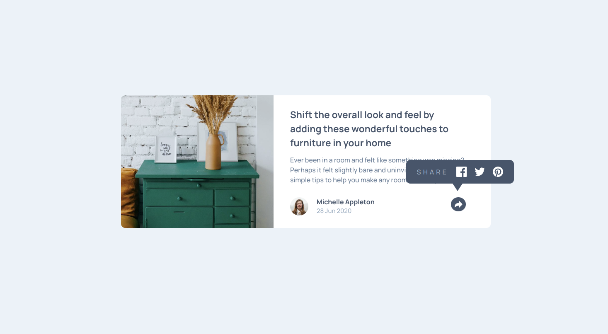
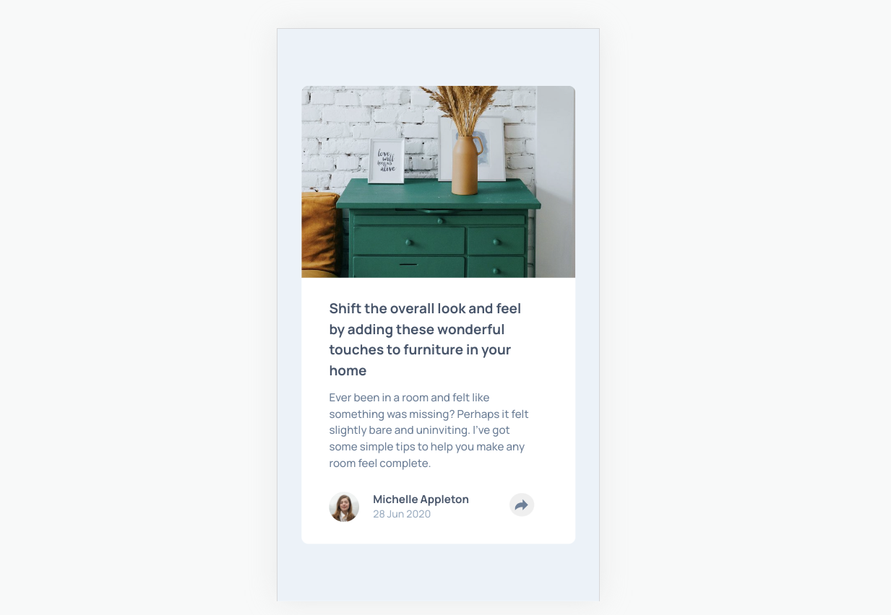

# Frontend Mentor - Article preview component solution
[Live site URL here](https://babar1532.github.io/article-preview-compo/)

This is a solution to the [Article preview component solution on Frontend Mentor](https://www.frontendmentor.io/challenges/article-preview-component-dYBN_pYFT). Frontend Mentor challenges help you improve your coding skills by building realistic projects.

## Table of contents

- [Overview](#overview)
  - [The challenge](#the-challenge)
  - [Screenshot](#screenshot)
  - [Links](#links)
- [My process](#my-process)
  - [Built with](#built-with)
  - [Useful resources](#useful-resources)
- [Author](#author)

## Overview
### The challenge

Users should be able to:

- View the optimal layout for the interface depending on their device's screen size
- See hover and focus states for all interactive elements on the page
### Screenshot

 
### Links

- Solution URL: [Solution URL here](https://github.com/BABAR1532/article-preview-compo)
- Live Site URL: [Live site URL here](https://babar1532.github.io/article-preview-compo/)

## My process

### Built with

- Semantic HTML5 markup
- CSS custom properties
- BEM (Block, Element, Modifier) Method
- Flexbox
- Clamp property of CSS

### Useful resources
- [BEM](https://getbem.com/naming/) - This help me how to use method BEM for naming convention.
- [ CSS Clamp()](https://developer.mozilla.org/en-US/docs/Web/CSS/clamp) - This help to get perfect reponsive layout 

- [Author](#author)
  - Coded by Ankit Kumar
  - Frontend Mentor profile  [@BABAR1532](https://www.frontendmentor.io/profile/BABAR1532)